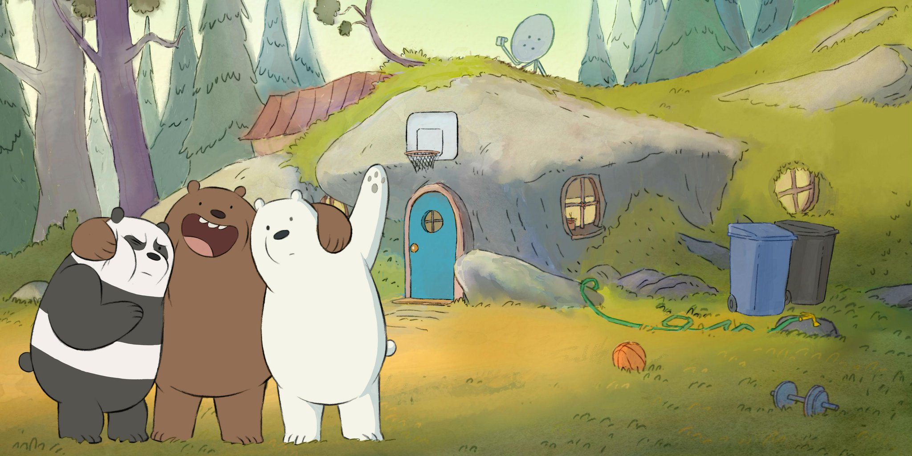

<!-- Vitbautroi -->

<h2 align ="center">🛠 Technologies and Tools 🛠</h2>
 
<!-- https://simpleicons.org/ -->

&nbsp;

&nbsp;

&nbsp;

&nbsp;

&nbsp;

&nbsp;

&nbsp;

&nbsp;

&nbsp;

&nbsp;

&nbsp;

&nbsp;

&nbsp;

&nbsp;

&nbsp;

&nbsp;

&nbsp;

&nbsp;

&nbsp;

&nbsp;

 
<h2 align="center">🔥 GitHub Stats 🔥</h2>
<!-- https://github.com/anuraghazra/github-readme-stats -->
 

  
  

 
<h2 align="center">👽 Where to find me 👽</h2>
 
<!-- https://icons8.com -->

  </a>
  
  
  
  
  

 

<h2 align="center">📖 Câu chuyện truyền cảm hứng 📖</h2>
 

  <a href="https://lofivitbautroi.vercel.app/" target="_blank">
    <strong> Con đường ngắn nhất để thoát khỏi gian nan là đi xuyên qua nó</strong>
  </a>

<strong>☕ Một chàng trai đang gặp nhiều khó khăn, anh bị tổn thương và trở nên mất niềm tin vào cuộc sống. Anh đến hỏi một ông già thông thái. Nghe kể xong, ông chẳng nói lời nào mà chỉ im lặng đặt chiếc nồi lên bếp, đổ vào nồi một ít nước và cho vào một củ cà rốt, một cục muối và một quả trứng. Sau khi đun sôi, ông mở nắp và trầm ngâm im lặng nhìn anh ta.
</strong>

<strong>☕ Sau một hồi ông bắt đầu nói: Ai sống trên đời cũng phải trải qua khó khăn, thử thách cả. Nhưng điều quan trọng là sau đó mọi việc sẽ như thế nào?
Hãy nhìn xem cục muối với vẻ rắn chắc bên ngoài nhưng khi bỏ vào nước là tan, củ cà rốt cứng cáp khi bị nóng cũng trở nên mềm đi. Còn quả trứng tuy mỏng manh nhưng khi qua nước sôi nóng bỏng lại trở nên cứng cáp hơn.</strong>

  <strong>🔗 Liên hệ với mình tại Instagram: <a href="https://instagram.com/cuakicuc.exe" target="_blank">HOKAGE LÀNG ĐÁ</a></strong>
   
  <strong>🔗 Liên hệ với mình tại Facebook: <a href="https://www.facebook.com/profile.php?id=100018205177111" target="_blank">Lê Bảo Việt</a></strong>
   
  <strong>📧 Hoặc Email: <a href="mailto:lbaoviet21@gmail.com" target="_top">lbaoviet21@gmail.com</a></strong>

 
<h2 align="center">📑 My Favorites Quote 📑</h2>
 

